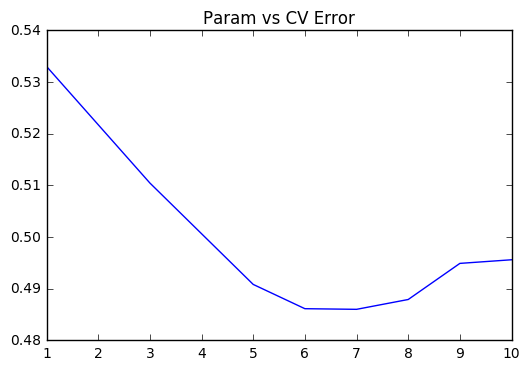

# 关键词搜索

Kaggle竞赛题：https://www.kaggle.com/c/home-depot-product-search-relevance

鉴于课件里已经完整的show了NLTK在各个NLP处理上的用法，我这里就不再重复使用了。

本篇的教程里会尽量用点不一样的库，让大家感受一下Python NLP领域各个库的优缺点。

## Step1：导入所需

所有要用到的库


```python
import numpy as np
import pandas as pd
from sklearn.ensemble import RandomForestRegressor, BaggingRegressor
from nltk.stem.snowball import SnowballStemmer
```

读入训练/测试集


```python
df_train = pd.read_csv('../input/train.csv', encoding="ISO-8859-1")
df_test = pd.read_csv('../input/test.csv', encoding="ISO-8859-1")
```

这里还有个有用的玩意儿，叫产品介绍


```python
df_desc = pd.read_csv('../input/product_descriptions.csv')
```

看看数据们都长什么样子


```python
df_train.head()
```


<div>
<table border="1" class="dataframe">
  <thead>
    <tr style="text-align: right;">
      <th></th>
      <th>id</th>
      <th>product_uid</th>
      <th>product_title</th>
      <th>search_term</th>
      <th>relevance</th>
    </tr>
  </thead>
  <tbody>
    <tr>
      <th>0</th>
      <td>2</td>
      <td>100001</td>
      <td>Simpson Strong-Tie 12-Gauge Angle</td>
      <td>angle bracket</td>
      <td>3.00</td>
    </tr>
    <tr>
      <th>1</th>
      <td>3</td>
      <td>100001</td>
      <td>Simpson Strong-Tie 12-Gauge Angle</td>
      <td>l bracket</td>
      <td>2.50</td>
    </tr>
    <tr>
      <th>2</th>
      <td>9</td>
      <td>100002</td>
      <td>BEHR Premium Textured DeckOver 1-gal. #SC-141 ...</td>
      <td>deck over</td>
      <td>3.00</td>
    </tr>
    <tr>
      <th>3</th>
      <td>16</td>
      <td>100005</td>
      <td>Delta Vero 1-Handle Shower Only Faucet Trim Ki...</td>
      <td>rain shower head</td>
      <td>2.33</td>
    </tr>
    <tr>
      <th>4</th>
      <td>17</td>
      <td>100005</td>
      <td>Delta Vero 1-Handle Shower Only Faucet Trim Ki...</td>
      <td>shower only faucet</td>
      <td>2.67</td>
    </tr>
  </tbody>
</table>
</div>


```python
df_desc.head()
```


<div>
<table border="1" class="dataframe">
  <thead>
    <tr style="text-align: right;">
      <th></th>
      <th>product_uid</th>
      <th>product_description</th>
    </tr>
  </thead>
  <tbody>
    <tr>
      <th>0</th>
      <td>100001</td>
      <td>Not only do angles make joints stronger, they ...</td>
    </tr>
    <tr>
      <th>1</th>
      <td>100002</td>
      <td>BEHR Premium Textured DECKOVER is an innovativ...</td>
    </tr>
    <tr>
      <th>2</th>
      <td>100003</td>
      <td>Classic architecture meets contemporary design...</td>
    </tr>
    <tr>
      <th>3</th>
      <td>100004</td>
      <td>The Grape Solar 265-Watt Polycrystalline PV So...</td>
    </tr>
    <tr>
      <th>4</th>
      <td>100005</td>
      <td>Update your bathroom with the Delta Vero Singl...</td>
    </tr>
  </tbody>
</table>
</div>


看来不要做太多的复杂处理，我们于是直接合并测试/训练集，以便于统一做进一步的文本预处理


```python
df_all = pd.concat((df_train, df_test), axis=0, ignore_index=True)
```


```python
df_all.head()
```


<div>
<table border="1" class="dataframe">
  <thead>
    <tr style="text-align: right;">
      <th></th>
      <th>id</th>
      <th>product_title</th>
      <th>product_uid</th>
      <th>relevance</th>
      <th>search_term</th>
    </tr>
  </thead>
  <tbody>
    <tr>
      <th>0</th>
      <td>2</td>
      <td>Simpson Strong-Tie 12-Gauge Angle</td>
      <td>100001</td>
      <td>3.00</td>
      <td>angle bracket</td>
    </tr>
    <tr>
      <th>1</th>
      <td>3</td>
      <td>Simpson Strong-Tie 12-Gauge Angle</td>
      <td>100001</td>
      <td>2.50</td>
      <td>l bracket</td>
    </tr>
    <tr>
      <th>2</th>
      <td>9</td>
      <td>BEHR Premium Textured DeckOver 1-gal. #SC-141 ...</td>
      <td>100002</td>
      <td>3.00</td>
      <td>deck over</td>
    </tr>
    <tr>
      <th>3</th>
      <td>16</td>
      <td>Delta Vero 1-Handle Shower Only Faucet Trim Ki...</td>
      <td>100005</td>
      <td>2.33</td>
      <td>rain shower head</td>
    </tr>
    <tr>
      <th>4</th>
      <td>17</td>
      <td>Delta Vero 1-Handle Shower Only Faucet Trim Ki...</td>
      <td>100005</td>
      <td>2.67</td>
      <td>shower only faucet</td>
    </tr>
  </tbody>
</table>
</div>


合并之后我们得到:


```python
df_all.shape
```


    (240760, 5)


产品介绍也是一个极有用的信息，我们把它拿过来：


```python
df_all = pd.merge(df_all, df_desc, how='left', on='product_uid')
```


```python
df_all.head()
```


<div>
<table border="1" class="dataframe">
  <thead>
    <tr style="text-align: right;">
      <th></th>
      <th>id</th>
      <th>product_title</th>
      <th>product_uid</th>
      <th>relevance</th>
      <th>search_term</th>
      <th>product_description</th>
    </tr>
  </thead>
  <tbody>
    <tr>
      <th>0</th>
      <td>2</td>
      <td>Simpson Strong-Tie 12-Gauge Angle</td>
      <td>100001</td>
      <td>3.00</td>
      <td>angle bracket</td>
      <td>Not only do angles make joints stronger, they ...</td>
    </tr>
    <tr>
      <th>1</th>
      <td>3</td>
      <td>Simpson Strong-Tie 12-Gauge Angle</td>
      <td>100001</td>
      <td>2.50</td>
      <td>l bracket</td>
      <td>Not only do angles make joints stronger, they ...</td>
    </tr>
    <tr>
      <th>2</th>
      <td>9</td>
      <td>BEHR Premium Textured DeckOver 1-gal. #SC-141 ...</td>
      <td>100002</td>
      <td>3.00</td>
      <td>deck over</td>
      <td>BEHR Premium Textured DECKOVER is an innovativ...</td>
    </tr>
    <tr>
      <th>3</th>
      <td>16</td>
      <td>Delta Vero 1-Handle Shower Only Faucet Trim Ki...</td>
      <td>100005</td>
      <td>2.33</td>
      <td>rain shower head</td>
      <td>Update your bathroom with the Delta Vero Singl...</td>
    </tr>
    <tr>
      <th>4</th>
      <td>17</td>
      <td>Delta Vero 1-Handle Shower Only Faucet Trim Ki...</td>
      <td>100005</td>
      <td>2.67</td>
      <td>shower only faucet</td>
      <td>Update your bathroom with the Delta Vero Singl...</td>
    </tr>
  </tbody>
</table>
</div>


好了，现在我们得到一个全体的数据大表格

## Step 2: 文本预处理

我们这里遇到的文本预处理比较简单，因为最主要的就是看关键词是否会被包含。

所以我们统一化我们的文本内容，以达到任何term在我们的数据集中只有一种表达式的效果。

我们这里用简单的Stem做个例子：

（有兴趣的同学可以选用各种你觉得靠谱的预处理方式：去掉停止词，纠正拼写，去掉数字，去掉各种emoji，等等）


```python
stemmer = SnowballStemmer('english')

def str_stemmer(s):
    return " ".join([stemmer.stem(word) for word in s.lower().split()])
```

为了计算『关键词』的有效性，我们可以naive地直接看『出现了多少次』


```python
def str_common_word(str1, str2):
    return sum(int(str2.find(word)>=0) for word in str1.split())
```

接下来，把每一个column都跑一遍，以清洁所有的文本内容


```python
df_all['search_term'] = df_all['search_term'].map(lambda x:str_stemmer(x))
```


```python
df_all['product_title'] = df_all['product_title'].map(lambda x:str_stemmer(x))
```


```python
df_all['product_description'] = df_all['product_description'].map(lambda x:str_stemmer(x))
```

## Step 3: 自制文本特征

一般属于一种脑洞大开的过程，想到什么可以加什么。

当然，特征也不是越丰富越好，稍微靠谱点是肯定的。

#### 关键词的长度：


```python
df_all['len_of_query'] = df_all['search_term'].map(lambda x:len(x.split())).astype(np.int64)
```

#### 标题中有多少关键词重合


```python
df_all['commons_in_title'] = df_all.apply(lambda x:str_common_word(x['search_term'],x['product_title']), axis=1)
```

#### 描述中有多少关键词重合


```python
df_all['commons_in_desc'] = df_all.apply(lambda x:str_common_word(x['search_term'],x['product_description']), axis=1)
```

搞完之后，我们把不能被『机器学习模型』处理的column给drop掉


```python
df_all = df_all.drop(['search_term','product_title','product_description'],axis=1)
```

## Step 4: 重塑训练/测试集

数据处理也是如此，搞完一圈预处理之后，我们让数据重回原本的样貌

#### 分开训练和测试集


```python
df_train = df_all.loc[df_train.index]
df_test = df_all.loc[df_test.index]
```

#### 记录下测试集的id

留着上传的时候 能对的上号


```python
test_ids = df_test['id']
```

#### 分离出y_train


```python
y_train = df_train['relevance'].values
```

#### 把原集中的label给删去

否则就是cheating了


```python
X_train = df_train.drop(['id','relevance'],axis=1).values
X_test = df_test.drop(['id','relevance'],axis=1).values
```

## Step 5: 建立模型

我们用个最简单的模型：Ridge回归模型


```python
from sklearn.ensemble import RandomForestRegressor
from sklearn.model_selection import cross_val_score
```

用CV结果保证公正客观性；并调试不同的alpha值


```python
params = [1,3,5,6,7,8,9,10]
test_scores = []
for param in params:
    clf = RandomForestRegressor(n_estimators=30, max_depth=param)
    test_score = np.sqrt(-cross_val_score(clf, X_train, y_train, cv=5, scoring='neg_mean_squared_error'))
    test_scores.append(np.mean(test_score))
```

画个图来看看：


```python
import matplotlib.pyplot as plt
%matplotlib inline
plt.plot(params, test_scores)
plt.title("Param vs CV Error");
```





大概6~7的时候达到了最优解

## Step 6: 上传结果

用我们测试出的最优解建立模型，并跑跑测试集


```python
rf = RandomForestRegressor(n_estimators=30, max_depth=6)
```


```python
rf.fit(X_train, y_train)
```


    RandomForestRegressor(bootstrap=True, criterion='mse', max_depth=6,
               max_features='auto', max_leaf_nodes=None,
               min_impurity_split=1e-07, min_samples_leaf=1,
               min_samples_split=2, min_weight_fraction_leaf=0.0,
               n_estimators=30, n_jobs=1, oob_score=False, random_state=None,
               verbose=0, warm_start=False)


```python
y_pred = rf.predict(X_test)
```

把拿到的结果，放进PD，做成CSV上传：


```python
pd.DataFrame({"id": test_ids, "relevance": y_pred}).to_csv('submission.csv',index=False)
```

## 总结：

1. **文本预处理步骤**: 使用很多不同的方法来使得文本数据变得更加清洁

2. **自制的特征**: 相处更多的特征值表达方法（关键词全段重合数量，重合比率，等等）

3. **更好的回归模型**: Ensemble方法，把分类器提升到极致


```python

```
